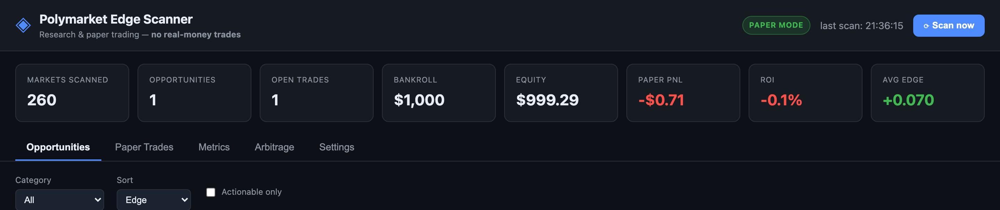
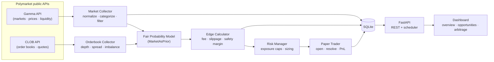
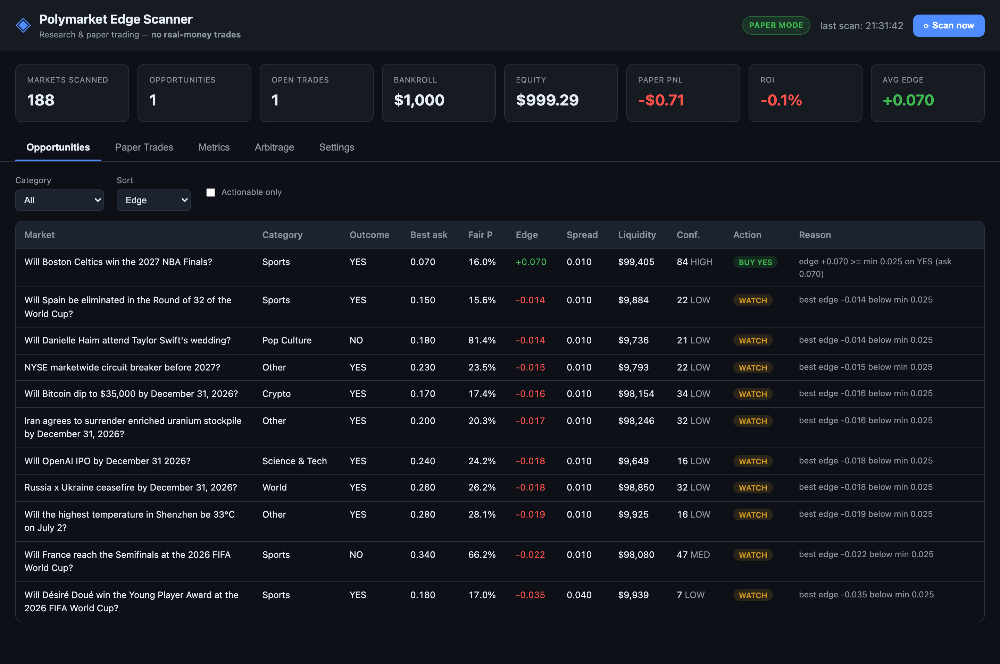
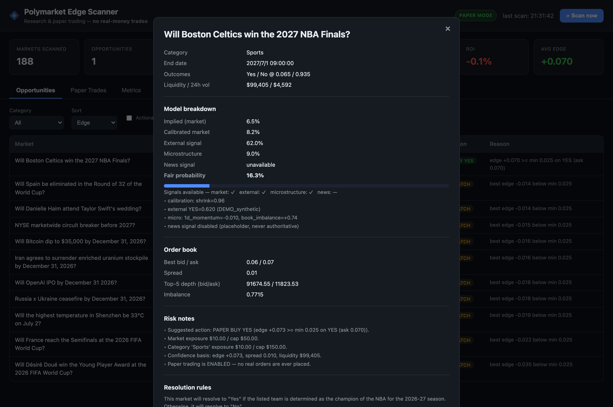
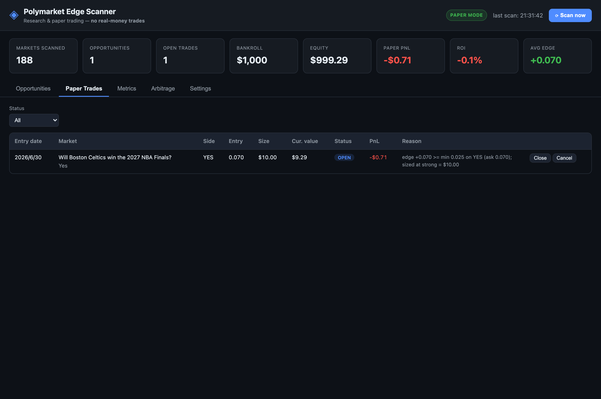
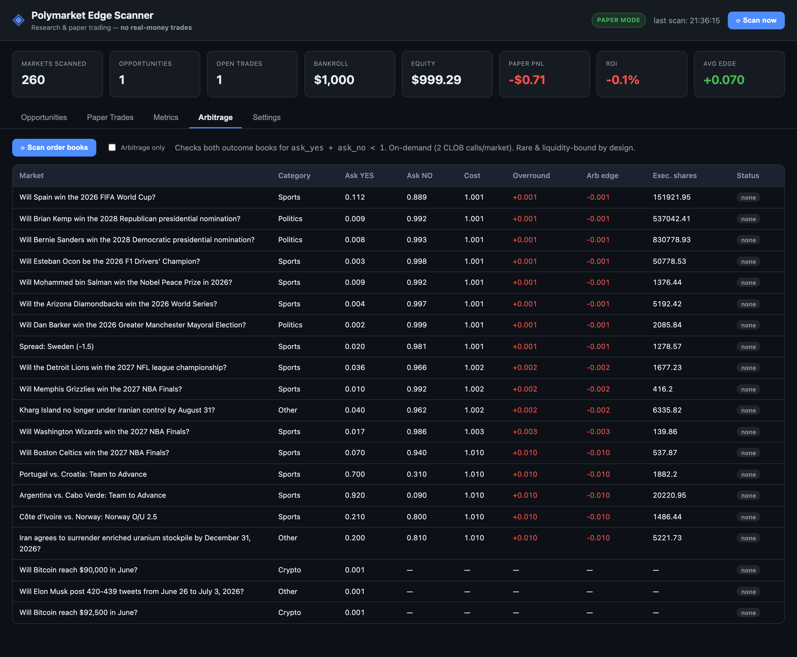

# Polymarket Edge Scanner

> **A research-only prediction-market edge scanner that tests whether external
> probability models can identify mispriced Polymarket markets.**


It scans active Polymarket markets, estimates a *fair* probability, compares it
against the tradable price, computes an **edge after fees, slippage, and a safety
margin**, ranks opportunities, and records **paper trades** — then measures, over
win rate, ROI, Brier score, and calibration, whether the signal was actually real.

> ⚠️ **Paper trading only.** No real orders. No wallet or private keys. No profit
> guarantee. Public read-only APIs exclusively.



---

## Why this matters

Prediction markets are a remarkably good probability machine — the live price of a
YES share is the crowd's consensus probability of an event. That makes **the
market price the baseline you have to beat**, not a number to ignore.

- **The price is the prior.** A serious tool starts from the market-implied
  probability, not from a hunch. This project bakes that in as a
  `MarketAsPriorModel`.
- **Edge is rare and expensive to capture.** A genuine opportunity only exists
  when your *fair* probability exceeds the *tradable* price by more than the sum
  of **fee + slippage + a safety margin**. Most apparent "edges" evaporate once
  you subtract those frictions.
- **Signals must be validated, not trusted.** Believing a model is easy; proving
  it is hard. **Paper trading** records every signal as a simulated position and
  scores it after resolution (win rate, realized return, **Brier score**,
  calibration) — so you can tell a real edge from noise without risking a cent.
- **Honest by construction.** With no external signal configured, fair ≈ market
  and the scanner reports **~0 edge**. That is the correct answer for an efficient
  market, and it is exactly what the academic literature finds for Polymarket
  (see [References](#references-repos--papers-surveyed)).

---

## What this project does

- Pulls **active markets** from Polymarket's public Gamma API (prices, spread,
  liquidity, 24h volume, end date, category, outcomes, resolution rules).
- Pulls **order-book depth** from the public CLOB API on demand (market detail).
- Applies **quality filters** (liquidity, volume, spread, time-to-resolution,
  binary/clear resolution, extreme-price exclusion).
- Estimates a **fair probability** with a conservative `MarketAsPriorModel`
  (market price as the prior + small, transparent, *bounded* adjustments).
- Computes **edge** for YES and NO after fee + slippage + safety margin.
- Suggests an action: `WATCH` / `PAPER BUY YES` / `PAPER BUY NO` / `AVOID`.
- Sizes positions with a strict **risk manager** (per-trade, per-market, and
  per-category exposure caps; never negative cash).
- Records **paper trades**, marks them to market, resolves them when the market
  settles, and reports **PnL + calibration metrics**.
- Detects **model-free single-market arbitrage** (rebalancing/bundle): on demand,
  checks both outcome books for `ask_yes + ask_no < 1`. Read-only research view —
  motivated by the academic literature (these are rare, short-lived, and
  liquidity-bounded; see References).
- Serves a clean **local dashboard** (overview cards, opportunities, market
  detail, paper trades, metrics, settings).

## What this project does **NOT** do

- ❌ It does **not** place live, real-money orders. Paper trading only.
- ❌ It does **not** bypass geo-restrictions, KYC, API terms, or rate limits.
- ❌ It does **not** use an LLM/news feed to *make* trading decisions. Any future
  news signal is capped to a small, advisory adjustment with an explanation.
- ❌ It does **not** promise profit. With no external data, fair ≈ market price,
  so it will (correctly) find **zero** edge most of the time.

## ⚖️ Legal / compliance disclaimer

This software is provided for **educational and research purposes only**. It is
not financial, investment, or legal advice. Prediction markets may be restricted
or prohibited in your jurisdiction. You are solely responsible for complying with
all applicable laws and with Polymarket's Terms of Service. Only public,
read-only API endpoints are used. The authors accept no liability for any use of
this software. **Nothing here constitutes a recommendation to trade.**

---

## Key technical highlights

- **FastAPI backend** with a background **APScheduler** scan loop and an
  auto-generated OpenAPI/Swagger UI at `/docs`.
- **SQLite persistence** via SQLAlchemy 2.0 typed ORM (markets, opportunities,
  paper trades, runtime settings).
- **Polymarket Gamma + CLOB integration** through a defensive, read-only client
  (rate limiter, TTL cache, on-disk raw cache, bounded retries).
- **Market microstructure analysis** — order-book depth, spread, liquidity,
  24h volume, and top-of-book imbalance.
- **`MarketAsPriorModel`** — market price as the prior, blended with bounded,
  fully-transparent external / microstructure / news signals.
- **Friction-aware edge** — `fee + slippage + safety_margin` subtracted before
  any signal is considered actionable.
- **Paper-trading ledger** — cash, equity, and PnL are *derived* from the trade
  ledger, so the books are consistent by construction.
- **Strict risk manager** — per-trade / per-market / per-category exposure caps,
  edge-tiered position sizing, no-negative-cash and duplicate guards.
- **Model-free arbitrage detector** — checks both outcome books for
  `ask_yes + ask_no < 1` (rebalancing/bundle arbitrage).
- **Evaluation & calibration** — win rate, ROI, average realized return,
  **Brier score**, and probability-bucket calibration.
- **Tested** — 35 unit tests across edge math, risk caps, paper-trade
  accounting, arbitrage, and duplicate-safe collection.

---

## Architecture



```
polymarket-edge-scanner/
├── backend/
│   ├── main.py                 # FastAPI app, scheduler, static dashboard mount
│   ├── config.py               # env-driven settings (pydantic-settings)
│   ├── db.py                   # SQLAlchemy engine/session, SQLite
│   ├── models.py               # ORM: Market, Opportunity, PaperTrade, SettingKV
│   ├── schemas.py              # Pydantic response/request models
│   ├── services/
│   │   ├── polymarket_client.py    # Gamma + CLOB client (rate limit, cache, retry)
│   │   ├── market_collector.py     # fetch → normalize → categorize → filter
│   │   ├── orderbook_collector.py  # CLOB depth + microstructure summary
│   │   ├── fair_probability.py     # MarketAsPriorModel + signal modules
│   │   ├── edge_calculator.py      # edge math, suggested action, confidence
│   │   ├── risk_manager.py         # sizing + exposure caps
│   │   ├── paper_trader.py         # open/close/resolve + account accounting
│   │   ├── backtester.py           # win rate, ROI, Brier, calibration
│   │   ├── news_signal.py          # bounded placeholder (never authoritative)
│   │   ├── settings_store.py       # runtime-adjustable settings (DB-backed)
│   │   └── scanner.py              # orchestrates one scan cycle
│   └── routes/                 # markets, opportunities, paper_trades, metrics, settings
├── frontend/                   # vanilla-JS dashboard served by FastAPI
├── data/                       # SQLite db + raw cache + external_signals.csv
├── notebooks/research.ipynb
├── tests/                      # edge, risk, paper-trader unit tests
├── requirements.txt
├── run.sh                      # one-command setup + run
└── .env.example
```

**Stack:** Python 3.11+, FastAPI, SQLAlchemy + SQLite, httpx, APScheduler, a
static vanilla-JS dashboard (no Node build step). Pandas is used only by the
research notebook, not at runtime.

---

## Setup

### Quick start (one command)

```bash
cd polymarket-edge-scanner
./run.sh
```

`run.sh` creates a virtual environment, installs dependencies, copies
`.env.example` to `.env` (first run only), and starts the app. Then open:

- **Dashboard:** http://127.0.0.1:8000
- **API docs (Swagger):** http://127.0.0.1:8000/docs

### Manual setup

```bash
python3.12 -m venv .venv          # any Python 3.11+
source .venv/bin/activate
pip install -r requirements.txt
cp .env.example .env
uvicorn backend.main:app --reload
```

### Run the tests

```bash
source .venv/bin/activate
pytest -q
```

---

## Screenshots

All screenshots are of the real dashboard running against **live Polymarket data**
(the paper trade shown comes from a synthetic external signal used for the demo).

**Opportunities** — every market ranked by friction-adjusted edge; one actionable
`BUY YES` signal at the top, the rest `WATCH` (honest, efficient market).



**Market detail** — the full, auditable model breakdown (implied → calibrated →
external → micro → news → fair) plus the live order book and risk notes.



**Paper trades** — the simulated ledger, marked to market with PnL and reasoning.



**Arbitrage** — both outcome books checked for `ask_yes + ask_no < 1`. Here every
market shows a positive *overround* (cost > $1) → **no arbitrage**, a textbook
demonstration of Polymarket's microstructural efficiency.



<details>
<summary>Regenerate these screenshots</summary>

They were captured from the live app via headless Chrome (DevTools Protocol). To
refresh them, run the app (`./run.sh`), trigger a scan, then re-capture into
`docs/screenshots/`. A simple single-shot example:

```bash
"/Applications/Google Chrome.app/Contents/MacOS/Google Chrome" \
  --headless=new --disable-gpu --hide-scrollbars --window-size=1440,1000 \
  --screenshot=docs/screenshots/dashboard-overview.png http://127.0.0.1:8000
```
</details>

---

## Environment variables

All settings have safe defaults; see [`.env.example`](.env.example) for the full,
commented list. Highlights:

| Variable | Default | Meaning |
|---|---|---|
| `PAPER_TRADING_ENABLED` | `true` | Record simulated trades during scans |
| `LIVE_TRADING_ENABLED` | `false` | **Not honored by the MVP** (documents intent only) |
| `PAPER_BANKROLL` | `1000` | Starting paper bankroll (USD) |
| `MAX_POSITION_PCT` | `0.01` | Max 1% of bankroll per trade |
| `MAX_MARKET_EXPOSURE_PCT` | `0.05` | Max 5% per market |
| `MAX_CATEGORY_EXPOSURE_PCT` | `0.15` | Max 15% per category |
| `MIN_LIQUIDITY` | `5000` | Quality filter |
| `MIN_VOLUME_24H` | `500` | Quality filter |
| `MAX_SPREAD` | `0.05` | Quality filter |
| `ESTIMATED_FEE` | `0.0` | Taker fee used in edge math |
| `SAFETY_MARGIN` | `0.015` | Subtracted from every edge |
| `MIN_EDGE_TO_TRADE` | `0.025` | Threshold to suggest a paper buy |
| `SCAN_INTERVAL_SECONDS` | `300` | Background scan cadence |
| `EXTERNAL_SIGNALS_CSV` | `data/external_signals.csv` | Optional external probabilities |

No secrets are required for the public read APIs. Never commit your `.env`.

---

## How to run the collector / scanner

- **Background:** the app runs a scan every `SCAN_INTERVAL_SECONDS` automatically
  (and once on startup, unless `SCAN_ON_STARTUP=false`).
- **On demand:** click **⟳ Scan now** in the dashboard, or:

  ```bash
  curl -X POST http://127.0.0.1:8000/api/scan
  ```

A scan: fetches markets → upserts them → rebuilds the opportunities snapshot →
opens paper trades for qualifying signals (if enabled) → settles any markets you
hold that have resolved.

---

## How paper trading works

Outcome shares are priced in `[0, 1]` and pay **$1 if the outcome wins**:

- Opening a position spends `size_usd` and buys `shares = size_usd / price`.
- **Mark to market:** `value = shares × current_outcome_price`.
- **Resolution:** a winning share pays `$1`; a losing share expires worthless.
- `realized_pnl = shares × exit_price − size_usd`.

Cash, equity, and PnL are **derived from the trade ledger**, so the books are
consistent by construction. Position sizing by edge strength:

| Edge | Strength | Size |
|---|---|---|
| `≥ 0.06` | strong | 1.0% of bankroll |
| `≥ 0.04` | medium | 0.5% of bankroll |
| `≥ 0.025` | weak | 0.25% of bankroll |

Sizes are then clipped to respect cash, per-trade, per-market, and per-category
caps. Duplicate positions on the same market/outcome are blocked unless
`ALLOW_AVERAGING=true`. Trade states: `OPEN`, `CLOSED`, `RESOLVED_WIN`,
`RESOLVED_LOSS`, `CANCELLED`.

### The fair-probability model

```
p_fair = 0.70 · calibrated_market_probability
       + 0.15 · external_signal_probability
       + 0.10 · microstructure_signal_probability
       + 0.05 · news_signal_probability
```

Any **unavailable** signal contributes the neutral market mid, so with no extra
data `p_fair` collapses back to a lightly-calibrated market price (hence ~0 edge
by default — this is intentional and honest). Each component is bounded and the
full breakdown is shown on the market detail page.

---

## How to add external signals

Drop a CSV at `data/external_signals.csv` (see
[`data/external_signals.example.csv`](data/external_signals.example.csv)):

```csv
market_slug,outcome,external_probability,source,timestamp
some-market-slug,Yes,0.58,my_model_or_odds,2026-06-30T00:00:00Z
```

- `market_slug` must match the Polymarket market slug (visible on the detail page).
- A `Yes` row is used directly; a `No` row is converted to `1 − p`.
- The file is re-read automatically when it changes — just re-scan.

This is the main lever for generating *real* signals (sports odds, poll
aggregates, your own model). Without it, the scanner stays flat by design.

---

## Future roadmap

- [ ] Sports-odds integration (auto-populate external signals)
- [ ] Kalshi / bookmaker cross-market comparison
- [ ] News-event extraction (bounded, advisory only)
- [ ] LLM-generated explanations (never the decision-maker)
- [ ] Proper historical backtesting on resolved-market archives
- [ ] Data-driven probability calibration (replace the shrink placeholder)
- [ ] Model calibration tracking over time
- [ ] Alerting via Telegram / Discord / email
- [ ] Live trading — only behind **explicit, per-trade manual approval**

---

## API reference (selected)

| Method | Path | Description |
|---|---|---|
| `GET` | `/api/health` | Liveness + safety flags |
| `POST` | `/api/scan` | Run one scan cycle now |
| `GET` | `/api/markets` | List stored markets |
| `GET` | `/api/markets/{id}` | Market detail + model breakdown + order book |
| `GET` | `/api/opportunities` | Ranked opportunities (filters/sort) |
| `GET` | `/api/paper-trades` | Paper trades (marked to market) |
| `POST` | `/api/paper-trades/{id}/close` | Close an open paper trade |
| `GET` | `/api/metrics/overview` | Headline cards |
| `GET` | `/api/metrics/evaluation` | Win rate, ROI, Brier, calibration |
| `GET` | `/api/arbitrage` | On-demand single-market rebalancing-arb scan |
| `GET`/`PATCH` | `/api/settings` | Read / update runtime settings |

Full interactive docs at `/docs` when the app is running.

---

## References (repos & papers surveyed)

This MVP was built *after* reviewing the ecosystem; we reused patterns
conceptually and avoided the unsafe parts (live trading, plaintext secrets,
geo/KYC bypass, profit hype).

**Official SDKs & docs**
- [Polymarket/py-clob-client](https://github.com/Polymarket/py-clob-client) (archived) → [py-clob-client-v2](https://github.com/Polymarket/py-clob-client-v2)
- [Polymarket API docs](https://docs.polymarket.com/api-reference/clients-sdks)

**Agents / bots**
- [Polymarket/agents](https://github.com/Polymarket/agents) — modular connectors + Pydantic models (good); no risk mgmt, archived, live `trade.py` (avoid)
- [ImMike/polymarket-arbitrage](https://github.com/ImMike/polymarket-arbitrage) — RiskManager, dry-run, FastAPI dashboard (good patterns); plaintext keys, no geo checks (avoid)
- Awesome lists: [harish-garg](https://github.com/harish-garg/Awesome-Polymarket-Tools), [aarora4/prediction-market-tools](https://github.com/aarora4/Awesome-Prediction-Market-Tools), [0xperp](https://github.com/0xperp/awesome-prediction-markets)

**Academic**
- [Arbitrage Analysis in Polymarket NBA Markets](https://arxiv.org/abs/2605.00864) — arb is rare (median 3.6s), liquidity-bounded (~15 shares)
- [Unravelling the Probabilistic Forest](https://arxiv.org/abs/2508.03474) — rebalancing vs combinatorial arbitrage
- [Anatomy of a Decentralized Prediction Market](https://arxiv.org/abs/2604.24366) & [SoK: DePM Microstructure](https://arxiv.org/pdf/2510.15612)

> **Why our default finds ~0 edge:** these papers document *profound
> microstructural efficiency* on Polymarket. A tool that claimed constant edge
> would be lying. Ours stays flat until you supply a genuine external signal.
